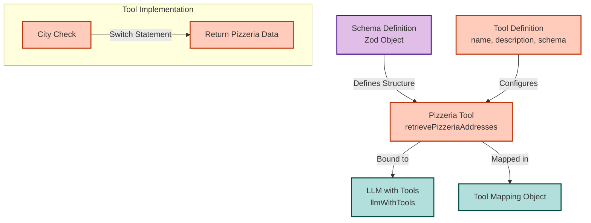
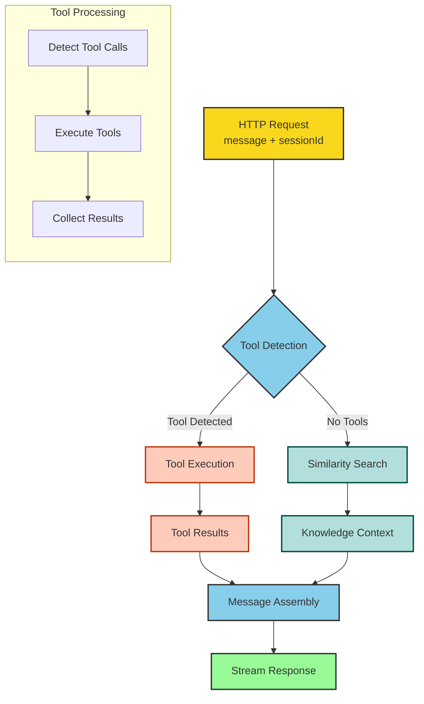

## Tool creation flow

```mermaid
graph TD
    %% Style definitions
    classDef schemaClass fill:#e1bee7,stroke:#4a148c,stroke-width:2px
    classDef toolClass fill:#ffccbc,stroke:#bf360c,stroke-width:2px
    classDef bindingClass fill:#b2dfdb,stroke:#004d40,stroke-width:2px

    %% Tool Creation
    Schema[Schema Definition<br/>Zod Object]:::schemaClass
    Tool[Pizzeria Tool<br/>retrievePizzeriaAddresses]:::toolClass
    ToolDef[Tool Definition<br/>name, description, schema]:::toolClass
    LLMBind[LLM with Tools<br/>llmWithTools]:::bindingClass
    Map[Tool Mapping Object]:::bindingClass

    %% Flow
    Schema -->|Defines Structure| Tool
    ToolDef -->|Configures| Tool
    Tool -->|Bound to| LLMBind
    Tool -->|Mapped in| Map

    %% Subgraph for Tool Implementation
    subgraph "Tool Implementation"
        CityCheck[City Check]:::toolClass
        DataReturn[Return Pizzeria Data]:::toolClass
        CityCheck -->|Switch Statement| DataReturn
    end
```

## Chat endpoint flow

```mermaid
graph TD
    %% Style definitions
    classDef inputClass fill:#f9d71c,stroke:#333,stroke-width:2px
    classDef processClass fill:#87ceeb,stroke:#333,stroke-width:2px
    classDef toolClass fill:#ffccbc,stroke:#bf360c,stroke-width:2px
    classDef vectorClass fill:#b2dfdb,stroke:#004d40,stroke-width:2px
    classDef outputClass fill:#98fb98,stroke:#333,stroke-width:2px

    %% Main Flow
    Request[HTTP Request<br/>message + sessionId]:::inputClass
    ToolCheck{Tool Detection}:::processClass
    
    %% Tool Path
    Tools[Tool Execution]:::toolClass
    ToolResults[Tool Results]:::toolClass
    
    %% RAG Path
    Search[Similarity Search]:::vectorClass
    Context[Knowledge Context]:::vectorClass
    
    %% Response Generation
    Assembly[Message Assembly]:::processClass
    Stream[Stream Response]:::outputClass
    
    %% Flow Connections
    Request --> ToolCheck
    
    ToolCheck -->|Tool Detected| Tools
    Tools --> ToolResults
    ToolResults --> Assembly
    
    ToolCheck -->|No Tools| Search
    Search --> Context
    Context --> Assembly
    
    Assembly --> Stream
    
    %% Subgraph for Tool Processing
    subgraph "Tool Processing"
        direction TB
        Detect[Detect Tool Calls]
        Execute[Execute Tools]
        Collect[Collect Results]
        
        Detect --> Execute
        Execute --> Collect
    end
```